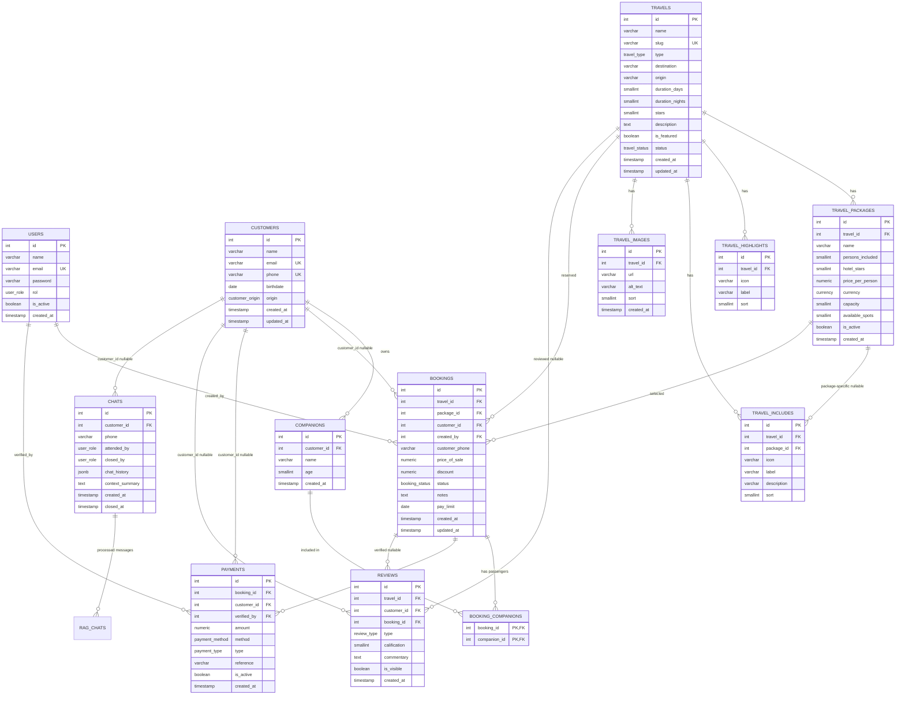
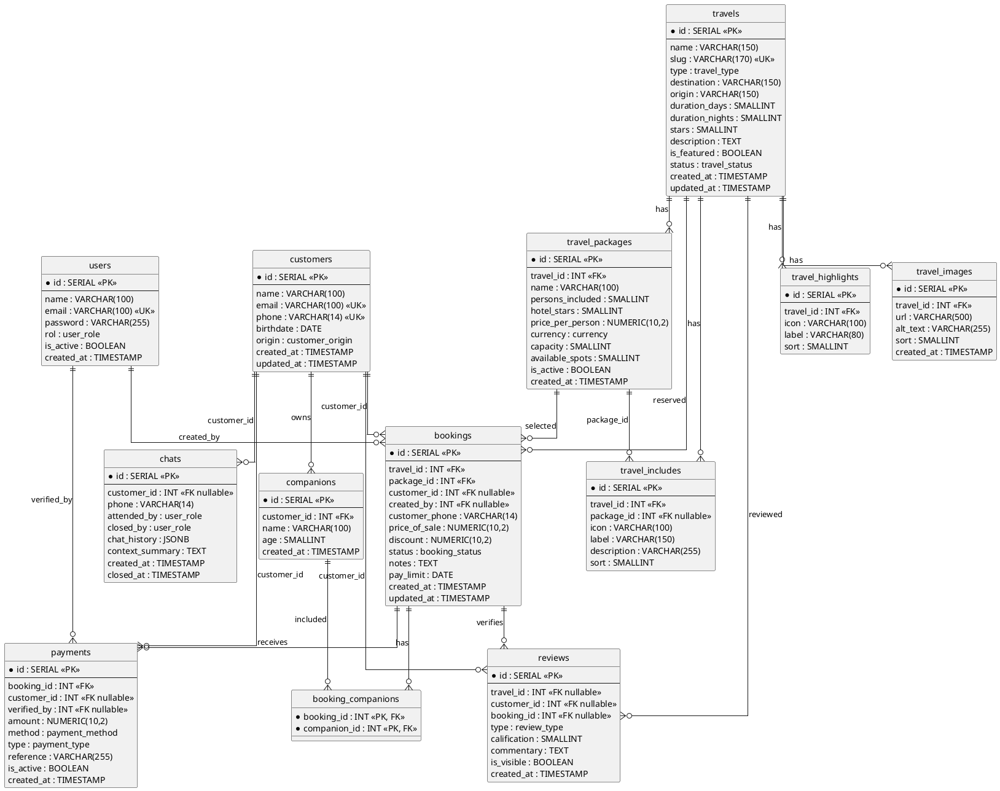

# Schema de Base de Datos — Travel Agency

**Versión:** 2.0
**Fecha:** 2026-04-29
**Motor:** PostgreSQL 16

---

## Diagrama E-R — Mermaid

## Diagrama E-R — PlantUML

---

## Sección 1 — Tablas sin relaciones

### `users`

Empleados de la agencia con acceso al panel administrativo.

| Columna | Tipo | Restricciones | Descripción |
|---|---|---|---|
| `id` | `SERIAL` | PK | |
| `name` | `VARCHAR(100)` | NOT NULL | |
| `email` | `VARCHAR(100)` | NOT NULL, UNIQUE | |
| `password` | `VARCHAR(255)` | NOT NULL | bcrypt costo mínimo 12 |
| `rol` | `user_role` | NOT NULL | IA-AGENT, AGENT, SELLER, ADMIN |
| `is_active` | `BOOLEAN` | NOT NULL, DEFAULT TRUE | |
| `created_at` | `TIMESTAMP` | NOT NULL, DEFAULT NOW() | |

---

### `customers`

Clientes registrados. El teléfono es el identificador principal para el RAG.

| Columna | Tipo | Restricciones | Descripción |
| --- | --- | --- | --- |
| `id` | `SERIAL` | PK | |
| `name` | `VARCHAR(100)` | NOT NULL | |
| `email` | `VARCHAR(100)` | UNIQUE, nullable | |
| `phone` | `VARCHAR(14)` | NOT NULL, UNIQUE | Formato E.164 |
| `birthdate` | `DATE` | nullable | |
| `origin` | `customer_origin` | NOT NULL, DEFAULT 'WHATSAPP' | WEB, WHATSAPP |
| `created_at` | `TIMESTAMP` | NOT NULL | |
| `updated_at` | `TIMESTAMP` | NOT NULL | Auto-actualizado por trigger |

---

### `travels`

Producto base mostrado como card en el sitio web.

| Columna | Tipo | Restricciones | Descripción |
|---|---|---|---|
| `id` | `SERIAL` | PK | |
| `name` | `VARCHAR(150)` | NOT NULL | Ej: "Bahía Mujeres Tulum" |
| `slug` | `VARCHAR(170)` | NOT NULL, UNIQUE | Para URLs del frontend |
| `type` | `travel_type` | NOT NULL | ALL_INCLUSIVE, CRUISE, CUSTOM |
| `destination` | `VARCHAR(150)` | NOT NULL | Ej: "Tulum, México" |
| `origin` | `VARCHAR(150)` | nullable | Ej: "Ciudad de México" |
| `duration_days` | `SMALLINT` | NOT NULL, > 0 | |
| `duration_nights` | `SMALLINT` | NOT NULL, > 0 | |
| `stars` | `SMALLINT` | 1–5, nullable | Estrellas del hotel |
| `description` | `TEXT` | NOT NULL | |
| `is_featured` | `BOOLEAN` | NOT NULL, DEFAULT FALSE | Aparece en el home |
| `status` | `travel_status` | NOT NULL, DEFAULT 'ACTIVE' | ACTIVE, INACTIVE, SOLD_OUT |
| `created_at` | `TIMESTAMP` | NOT NULL | |
| `updated_at` | `TIMESTAMP` | NOT NULL | Auto-actualizado por trigger |

**Lógica calculada al momento:**

- `"desde X MXN"` → `MIN(price_per_person) FROM travel_packages WHERE travel_id = ?`
- `puntuación` → `AVG(calification) FROM reviews WHERE travel_id = ?`

---

## Sección 2 — Tablas con relaciones

### `companions` → `customers`

Acompañantes vinculados a un cliente.

| Columna | Tipo | Restricciones | Descripción |
|---|---|---|---|
| `id` | `SERIAL` | PK | |
| `customer_id` | `INT` | NOT NULL, FK → customers, CASCADE | |
| `name` | `VARCHAR(100)` | NOT NULL | |
| `age` | `SMALLINT` | NOT NULL, > 0 | |
| `created_at` | `TIMESTAMP` | NOT NULL | |

---

### `travel_packages` → `travels`

Variantes de precio y ocupación de un viaje.

| Columna | Tipo | Restricciones | Descripción |
|---|---|---|---|
| `id` | `SERIAL` | PK | |
| `travel_id` | `INT` | NOT NULL, FK → travels, CASCADE | |
| `name` | `VARCHAR(100)` | NOT NULL | Ej: "Doble estándar" |
| `persons_included` | `SMALLINT` | NOT NULL, > 0 | |
| `hotel_stars` | `SMALLINT` | 1–5, nullable | |
| `price_per_person` | `NUMERIC(10,2)` | NOT NULL, > 0 | |
| `currency` | `currency` | NOT NULL, DEFAULT 'MXN' | MXN, USD |
| `capacity` | `SMALLINT` | nullable | NULL = sin límite |
| `available_spots` | `SMALLINT` | nullable | NULL cuando capacity es NULL |
| `is_active` | `BOOLEAN` | NOT NULL, DEFAULT TRUE | |
| `created_at` | `TIMESTAMP` | NOT NULL | |

**Restricción:** `capacity` y `available_spots` ambos NULL o ambos NOT NULL.

---

### `travel_highlights` → `travels`

Badges de lectura rápida del card.

| Columna | Tipo | Restricciones |
|---|---|---|
| `id` | `SERIAL` | PK |
| `travel_id` | `INT` | NOT NULL, FK → travels, CASCADE |
| `icon` | `VARCHAR(100)` | NOT NULL |
| `label` | `VARCHAR(80)` | NOT NULL |
| `sort` | `SMALLINT` | NOT NULL, DEFAULT 0 |

---

### `travel_includes` → `travels`, `travel_packages` (nullable)

Detalle de qué incluye el viaje. Si `package_id` es NULL aplica a todos los paquetes.

| Columna | Tipo | Restricciones |
|---|---|---|
| `id` | `SERIAL` | PK |
| `travel_id` | `INT` | NOT NULL, FK → travels, CASCADE |
| `package_id` | `INT` | nullable, FK → travel_packages, CASCADE |
| `icon` | `VARCHAR(100)` | NOT NULL |
| `label` | `VARCHAR(150)` | NOT NULL |
| `description` | `VARCHAR(255)` | nullable |
| `sort` | `SMALLINT` | NOT NULL, DEFAULT 0 |

---

### `travel_images` → `travels`

Galería de fotos. `sort = 0` es la portada.

| Columna | Tipo | Restricciones |
|---|---|---|
| `id` | `SERIAL` | PK |
| `travel_id` | `INT` | NOT NULL, FK → travels, CASCADE |
| `url` | `VARCHAR(500)` | NOT NULL |
| `alt_text` | `VARCHAR(255)` | NOT NULL |
| `sort` | `SMALLINT` | NOT NULL, DEFAULT 0 |
| `created_at` | `TIMESTAMP` | NOT NULL |

---

### `bookings` → `travels`, `travel_packages`, `customers` (nullable), `users` (nullable)

Reserva de un viaje. El cliente es opcional; el teléfono es obligatorio.
Pasajeros = `COUNT(*) FROM booking_companions WHERE booking_id = ?`.
Saldo = `price_of_sale - SUM(payments.amount WHERE is_active = TRUE)`.

| Columna | Tipo | Restricciones | Descripción |
|---|---|---|---|
| `id` | `SERIAL` | PK | |
| `travel_id` | `INT` | NOT NULL, FK → travels | |
| `package_id` | `INT` | NOT NULL, FK → travel_packages | |
| `customer_id` | `INT` | nullable, FK → customers, SET NULL | |
| `created_by` | `INT` | nullable, FK → users, SET NULL | |
| `customer_phone` | `VARCHAR(14)` | NOT NULL | Teléfono al momento de reservar |
| `price_of_sale` | `NUMERIC(10,2)` | NOT NULL, > 0 | Snapshot del precio acordado |
| `discount` | `NUMERIC(10,2)` | NOT NULL, DEFAULT 0 | |
| `status` | `booking_status` | NOT NULL, DEFAULT 'RESERVED' | RESERVED, CONFIRMED, CANCELLED, COMPLETED |
| `notes` | `TEXT` | nullable | Notas internas del agente |
| `pay_limit` | `DATE` | nullable | Fecha límite del saldo |
| `created_at` | `TIMESTAMP` | NOT NULL | |
| `updated_at` | `TIMESTAMP` | NOT NULL | Auto-actualizado por trigger |

---

### `booking_companions` → `bookings`, `companions`

Relación N:M. El conteo de esta tabla determina el número de pasajeros.

| Columna | Tipo | Restricciones |
|---|---|---|
| `booking_id` | `INT` | PK compuesta, FK → bookings, CASCADE |
| `companion_id` | `INT` | PK compuesta, FK → companions, CASCADE |

---

### `payments` → `bookings`, `customers` (nullable), `users` (nullable)

Pagos recibidos. Nunca se eliminan — `is_active = FALSE` para anular.

| Columna | Tipo | Restricciones | Descripción |
|---|---|---|---|
| `id` | `SERIAL` | PK | |
| `booking_id` | `INT` | NOT NULL, FK → bookings | |
| `customer_id` | `INT` | nullable, FK → customers, SET NULL | |
| `verified_by` | `INT` | nullable, FK → users, SET NULL | |
| `amount` | `NUMERIC(10,2)` | NOT NULL, > 0 | |
| `method` | `payment_method` | NOT NULL | CASH, TRANSFER, CARD, MIX |
| `type` | `payment_type` | NOT NULL | TOTAL, PARTIAL |
| `reference` | `VARCHAR(255)` | nullable | Número de transferencia, etc. |
| `is_active` | `BOOLEAN` | NOT NULL, DEFAULT TRUE | FALSE = pago anulado |
| `created_at` | `TIMESTAMP` | NOT NULL | |

---

### `reviews` → `travels` (nullable), `customers` (nullable), `bookings` (nullable)

Reseñas visibles en el sitio. Cualquier visitante puede dejar una.
Los FK nullable permiten distinguir el origen de cada reseña.

| Columna | Tipo | Restricciones | Descripción |
|---|---|---|---|
| `id` | `SERIAL` | PK | |
| `travel_id` | `INT` | nullable, FK → travels | NULL = reseña general de la agencia |
| `customer_id` | `INT` | nullable, FK → customers | NULL = visitante anónimo |
| `booking_id` | `INT` | nullable, FK → bookings | NOT NULL = reseña verificada |
| `type` | `review_type` | NOT NULL | POSITIVE, NEGATIVE, FEEDBACK, QUESTION, COMPLAINT |
| `calification` | `SMALLINT` | 1–5, nullable | |
| `commentary` | `TEXT` | nullable | |
| `is_visible` | `BOOLEAN` | NOT NULL, DEFAULT TRUE | |
| `created_at` | `TIMESTAMP` | NOT NULL | |

**Restricción:** `UNIQUE (customer_id, travel_id)` — un cliente, una reseña por viaje.

---

### `chats` → `customers` (nullable)

Almacenamiento frío. El RAG usa Redis como contexto activo.

| Columna | Tipo | Restricciones | Descripción |
|---|---|---|---|
| `id` | `SERIAL` | PK | |
| `customer_id` | `INT` | nullable, FK → customers, SET NULL | |
| `phone` | `VARCHAR(14)` | NOT NULL | Identificador principal |
| `attended_by` | `user_role` | NOT NULL, DEFAULT 'IA-AGENT' | |
| `closed_by` | `user_role` | nullable | NULL = chat abierto |
| `chat_history` | `JSONB` | NOT NULL, DEFAULT '[]' | Formato LangChain |
| `context_summary` | `TEXT` | nullable | Cargado en Redis en arranque frío |
| `created_at` | `TIMESTAMP` | NOT NULL | |
| `closed_at` | `TIMESTAMP` | nullable | NULL = chat abierto |

---

## Decisiones de diseño

**`customer_id` nullable en bookings, payments, reviews, chats**
Permite operar sin cliente registrado. El teléfono actúa como identificador provisional.

**Pasajeros via `booking_companions`**
El número de pasajeros no se guarda como campo — se obtiene contando `booking_companions`. Elimina inconsistencias entre un campo numérico y los acompañantes reales.

**Saldo calculado dinámicamente**
`price_of_sale - SUM(payments.amount WHERE is_active = TRUE)`. Nunca persiste para evitar inconsistencias con pagos anulados.

**`is_active` en payments**
Los pagos nunca se eliminan para conservar auditoría financiera completa.

**`context_summary` en chats**
El RAG usa Redis (TTL 24h) como contexto activo. Al cerrarse o expirar, el backend genera un `ConversationSummary` y lo persiste aquí. En arranque frío el RAG carga este campo en lugar del historial completo.

**Reviews abiertas y verificadas**
`customer_id` nullable permite reseñas generales anónimas de la agencia. Para reseñas públicas de un viaje asociadas a cliente, `booking_id` distingue reseñas verificadas; la regla de que la reserva esté `COMPLETED` se valida en backend.
